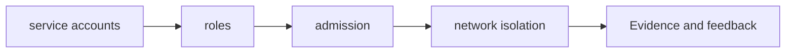

# Day 090 — Kubernetes Security: RBAC and NetworkPolicy

> Track: **advanced DevOps and SRE** · Suggested study time: **90–150 minutes**

## Why this matters

Kubernetes Security: RBAC and NetworkPolicy is part of the operational path from a developer commit to a reliable production service. Today's goal is to understand the system, practise the normal workflow, deliberately observe one failure, and leave reproducible evidence in Git.

## In plain English

Kubernetes is a reconciliation system. You declare what should exist, controllers compare that intent with reality, and the control plane keeps working to close the gap.



## Learning outcomes

By the end of the day you should be able to:

- describe service accounts and roles in plain language;
- use admission and network isolation in a small working lab;
- validate the result with evidence instead of assuming success;
- recognise one common failure and return safely to the previous state.

## Core ideas

- **service accounts** — a core operating concept in Kubernetes Security: RBAC and NetworkPolicy: understand its purpose, inputs, outputs, owner, normal signal, and failure signal. In the lab, observe it before and after one controlled change so the idea is tied to real evidence.
- **roles** — a trust control: it defines who or what may act, under which conditions, and what evidence is retained. In the lab, observe it before and after one controlled change so the idea is tied to real evidence.
- **admission** — a core operating concept in Kubernetes Security: RBAC and NetworkPolicy: understand its purpose, inputs, outputs, owner, normal signal, and failure signal. In the lab, observe it before and after one controlled change so the idea is tied to real evidence.
- **network isolation** — part of the request path: it decides how traffic is addressed, transported, filtered, or forwarded. In the lab, observe it before and after one controlled change so the idea is tied to real evidence.

The useful mental model is **desired state → action → observed state → evidence**. Write down what you expect before each change. After the change, check the service from both the operator's view and the user's view. A command returning zero is useful evidence, but a real request, metric, log entry, or restored file is stronger.

## Lab setup and safety

Use a disposable local or cloud sandbox and connect the lab to the capstone where useful. Define a rollback and a cost limit before starting.

1. Record the starting state and tool versions.
2. Make the smallest possible change.
3. Run a syntax or dry-run check where the tool supports it.
4. Apply the change and observe logs/events while it happens.
5. Test the happy path and one negative path.
6. Revert or clean up, then repeat from the README to prove reproducibility.

## Worked example

Run the following as a starting point, adapting names and addresses to your lab:

```bash
kubectl auth can-i --as=system:serviceaccount:demo:app get pods
```

Before running privileged or destructive operations, read the help page and confirm the target. Save relevant output in a text file under an `evidence/` directory, but redact tokens, passwords, private keys, public IPs, and personal data.

The project directory includes a safe helper. It checks tools and prints the plan, but never runs infrastructure-changing commands automatically:

```bash
bash project/lab.sh check
bash project/lab.sh plan
bash project/lab.sh verify
```

## Practical workflow

- **Discover:** inspect the current state without modifying it.
- **Plan:** state the intended result, risks, and rollback.
- **Implement:** keep configuration declarative and version-controlled where possible.
- **Verify:** test syntax, behaviour, logs, and the user-facing endpoint.
- **Break safely:** introduce one controlled error related to service accounts or admission.
- **Recover:** use the evidence to diagnose, roll back, and document the root cause.

## Project 1 — Guided build: Kubernetes Security: RBAC and NetworkPolicy

Build a clean lab that demonstrates all four concepts: **service accounts**, **roles**, **admission**, **network isolation**.

**Required deliverables**

- a short architecture diagram or request-flow sketch;
- version-controlled configuration or automation;
- a README with prerequisites, exact run steps, validation, and cleanup;
- captured evidence showing a successful result;
- a troubleshooting note for one mistake you actually tested.

**Acceptance test:** another person can start from a clean machine, follow only your README, run the validation command, and get the documented result.

## Project 2 — Production challenge: Kubernetes Security: RBAC and NetworkPolicy

Turn the first lab into an operations exercise. Add automation, deliberately create a failure around **roles**, and diagnose it without random changes. Add a health check or measurable signal, a rollback step, and a short incident timeline.

**Definition of done**

- secrets and machine-specific values are not committed;
- repeated execution is safe or its side effects are clearly documented;
- the negative test fails for the expected reason;
- rollback restores the original service;
- cleanup leaves no unexpected process, container, cloud resource, mount, or credential.

## Review questions

1. How would you explain service accounts to a developer who has not operated production systems?
2. Which signal proves roles is healthy?
3. What is the safest rollback if admission fails halfway through?
4. Which part should be automated next, and what new risk would that automation introduce?

## Completion checklist

- [ ] I can explain the four core ideas without reading the notes.
- [ ] I ran the worked example and saved redacted evidence.
- [ ] Project 1 passes from a clean start.
- [ ] Project 2 includes failure, diagnosis, recovery, and cleanup.
- [ ] I committed notes using a meaningful message and linked the evidence.

## Further reading

- Use the official documentation for the named tool or service as the source of truth.
- Use local manual pages (`man`, `--help`) for the exact installed version.
- Re-check cloud pricing, security guidance, and release notes before using the lab in production.
